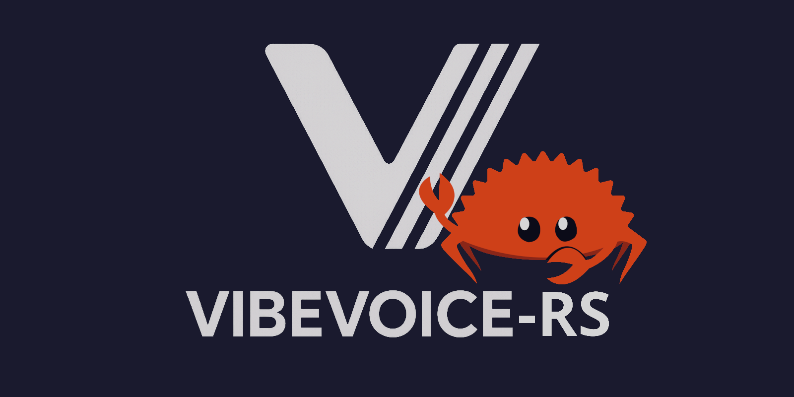

# VibeVoice-RS



Rust implementation of VibeVoice text-to-speech with voice cloning and multi-speaker synthesis.

## Features

- High-quality text-to-speech synthesis
- Voice cloning from audio samples
- Multi-speaker dialogue synthesis
- GPU acceleration (Metal/CUDA)
- Streaming audio generation (realtime model)

## Crate Structure

| Crate | Description | Documentation |
|-------|-------------|---------------|
| `vibevoice` | Core library | [README](vibevoice/README.md) |
| `vibevoice-cli` | Command-line interface | [README](vibevoice-cli/README.md) |
| `vibevoice-server` | HTTP server with SSE streaming | [README](vibevoice-server/README.md) |
| `vibevoice-web` | Leptos web frontend | [README](vibevoice-web/README.md) |
| `vibevoice-tauri` | Desktop application | [README](vibevoice-tauri/README.md) |

## Requirements

- Rust 1.75+
- HuggingFace account and token
- GPU recommended (Metal on Apple Silicon, CUDA on NVIDIA)

## Setup

### HuggingFace Token (Required)

```bash
# Create the cache directory
mkdir -p ~/.cache/huggingface

# Paste your token (get from https://huggingface.co/settings/tokens)
echo "hf_yourTokenHere" > ~/.cache/huggingface/token

# Secure it
chmod 600 ~/.cache/huggingface/token
```

## Known Issues

### Apple / Metal

Very long inputs may run over the buffer.

> Error: Metal error Failed to create metal resource: Buffer

PyTorch MPS uses optimized SDPA (Scaled Dot Product Attention) that doesn't materialize the full attention matrix. Candle has flash attention but it's CUDA-only, not available for Metal.
